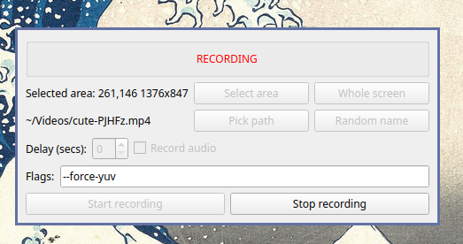
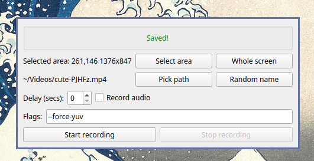

# Cute Sway Recorder

Screen recorder for [`wlroots`](https://gitlab.freedesktop.org/wlroots/wlroots/)-based compositors like `Sway` and `Hyperland`. For other compositors, it falls back to using [wlr-randr](https://sr.ht/~emersion/wlr-randr/) to get outputs.

More specifically, this project is merely a graphical [Qt](https://www.qt.io/) wrapper for [`wf-recorder`](https://github.com/ammen99/wf-recorder), leveraging [`slurp`](https://github.com/emersion/slurp) for selecting screen regions.




## Installation

```shell
pip install cute-sway-recorder
```

You might prefer using [pipx](https://pypa.github.io/pipx/):

```shell
pipx install cute-sway-recorder
```

## Contributing

PRs are welcome!

1. After forking this repository, make sure to install the project dependencies locally:

```bash
poetry install
```

This will create a virtual environment and install all the required dependencies.

2. Make sure `cute-sway-recorder` runs locally:

```bash
poetry run python -m cute_sway_recorder.main
```

## Alternatives

- [green-recorder](https://github.com/dvershinin/green-recorder) is a recent fork of the [project abandoned in 2019](https://github.com/mhsabbagh/green-recorder). It doesn't use `wf-recorder` under
  the hood. It currently has more features than this project; you might want to try it first, and come back here if it gives you a hard time.
